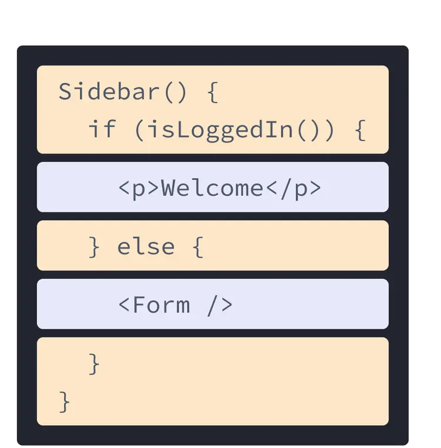
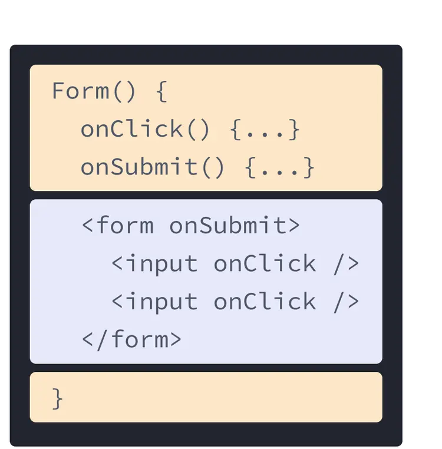

## Web Development w/React
<table>
    <tr>
        <td></td>
        <td></td>
    </tr>
    <tr>
        <td style="text-align: center;"><code>Sidebar.jsx</code></td>
        <td style="text-align: center;"><code>Form.jsx</code></td>
    </tr>
<table>