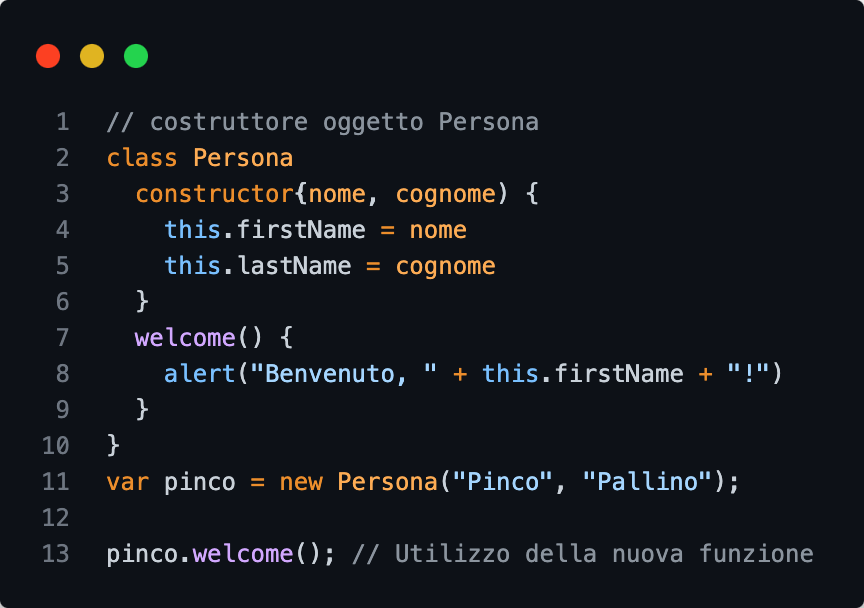
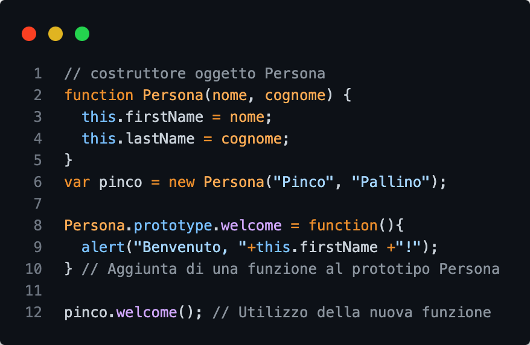
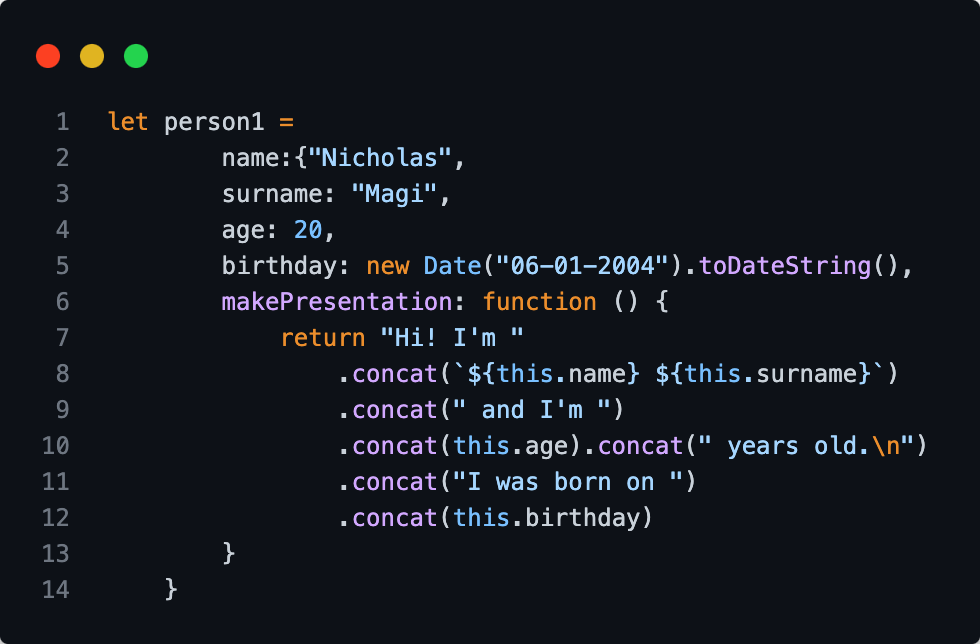

## JavaScript

Creazione di oggetti
<table>
    <th>
        Classe
    </th>
    <th>
        Prototipo
    </th>
    <th>
        JSON Notation
    </th>
    <tr>
        <td></td>
        <td></td>
        <td></td>
    </tr>
</table>